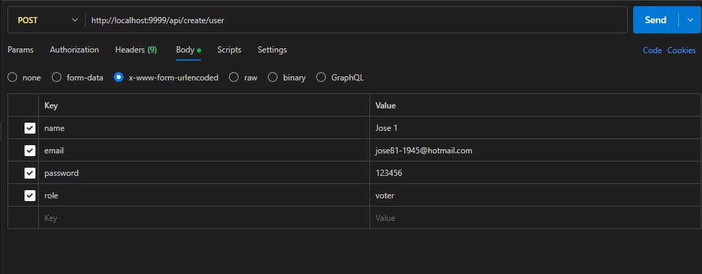
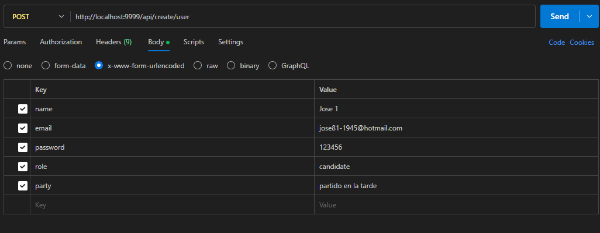
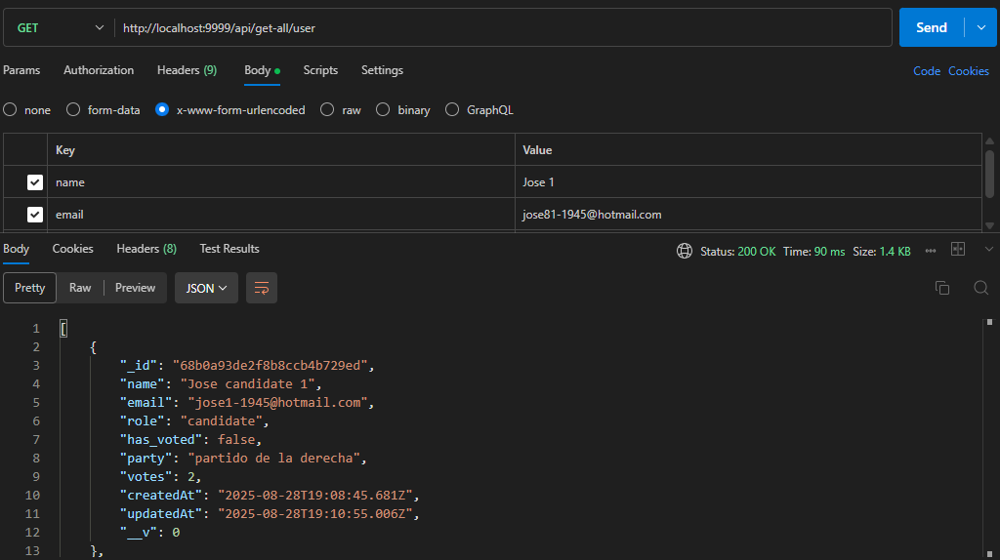
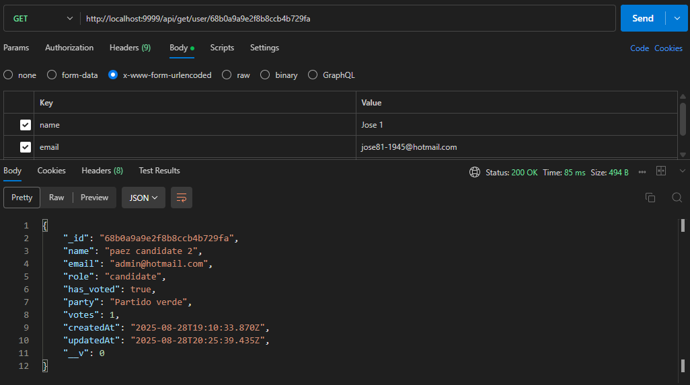
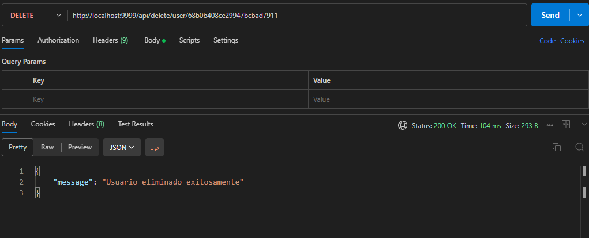
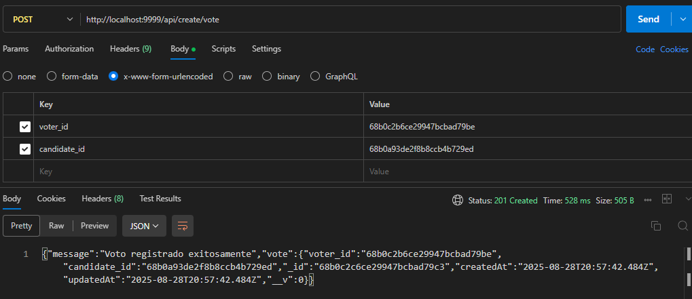
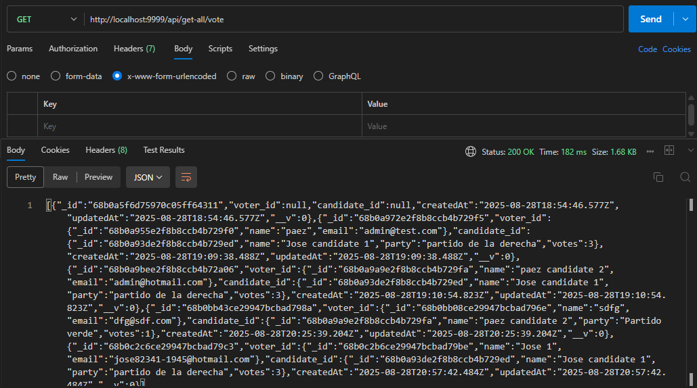
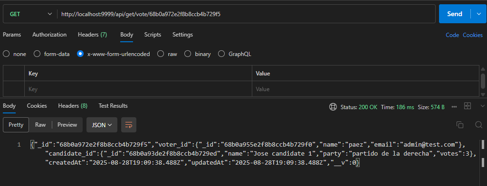
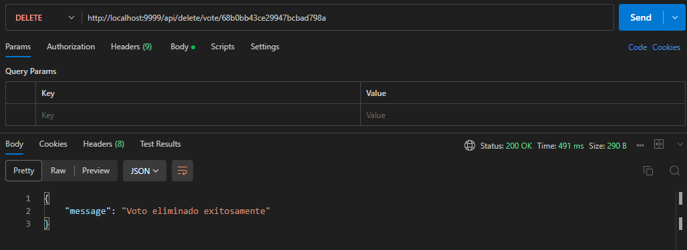
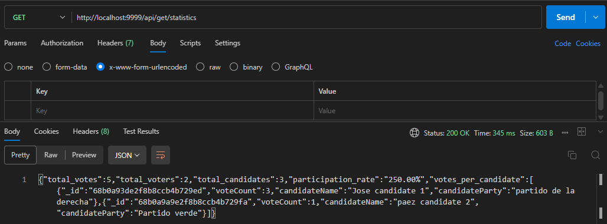

# 🗳️ Sistema de Votación Online - Prueba Técnica (New Inntech)

Este proyecto es una aplicación de votación online que permite a **administradores**, **candidatos** y **votantes** interactuar en un sistema seguro y sencillo.  
Incluye **backend con API REST** y **frontend con React**.

---

## 🚀 Instrucciones para ejecutar el proyecto localmente

### 1️⃣ Clonar el repositorio
```bash
git clone https://github.com/Josepaez07/Prueba_tecnica_new_inntech
```

---

### 2️⃣ Configuración del Backend
1. Ingresar a la carpeta del backend:
   ```bash
   cd back
   ```

2. Crear un archivo `.env` con las siguientes variables:
   ```env
   USERBD=jpaez5393
   PASSWORDBD=R0h5WZSByCC0n1xZ
   BD=VotingSystem
   PORT=9999
   JWT_SECRET=jwtScretPrueba
   ```

3. Instalar dependencias:
   ```bash
   npm install
   ```

4. Ejecutar el servidor:
   ```bash
   npm run dev
   ```

El backend estará disponible en:  
👉 `http://localhost:9999`

Y la documentación de endpoints en Swagger:  
👉 `http://localhost:9999/api-docs/#/`

---

### 3️⃣ Configuración del Frontend
1. Ingresar a la carpeta del frontend:
   ```bash
   cd front
   ```

2. Instalar dependencias:
   ```bash
   npm install
   ```

3. Ejecutar el servidor de desarrollo:
   ```bash
   npm run dev
   ```

El frontend estará disponible en:  
👉 `http://localhost:5173`

---

## 📌 Endpoints principales del API

La API expone múltiples recursos: **votantes, candidatos, votos y estadísticas**.  

### Capturas de pantalla

### 👥 Ejemplos para Usuarios






### 🗳️ Votos





### 📊 Estadísticas



---

## 📸 Capturas de pantalla

### 📊 Estadísticas en el Dashboard


### 🗳️ Vista de votación


---

## 👨‍💻 Tecnologías utilizadas
- **Backend:** Node.js, Express, MongoDB, JWT  
- **Frontend:** React, TailwindCSS, Recharts  
- **Autenticación:** JSON Web Tokens  
- **Gestión de estado:** LocalStorage / Context API  

---
